# Quiper

Quiper is a macOS status-bar app that keeps your AI chat services in a single floating window. A global hotkey reveals the overlay, every service gets ten pre-created WebKit tabs, and the app stays out of the Dock so you can drop into an AI convo and return to work without re-arranging windows.

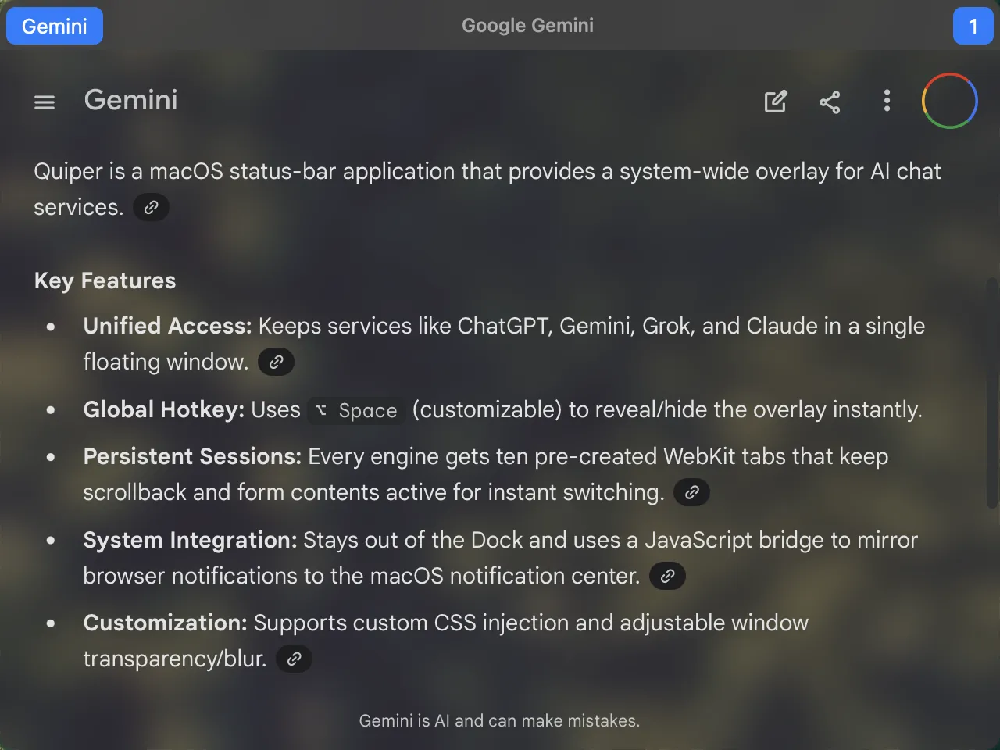

[](https://github.com/sassanh/quiper/actions/workflows/integration_delivery.yml)
[](https://opensource.org/licenses/MIT)
[](https://github.com/sassanh/quiper/releases)
[](https://codecov.io/gh/sassanh/quiper)

## Highlights

- **Overlay built for AI sites** – Define any site that works in Safari (ChatGPT, Gemini, Grok, Claude, internal tools, etc.). Quiper opens each one inside its own `WKWebView` stack so session switches are instant.
- **Keyboard first** – The default global shortcut is `⌥ Space`, but you can record any combination.
- **Persistent sessions** – Each service owns ten live `WKWebView`s. They keep scrollback and form contents, while cookies/cache live in the shared WebKit store so authentication survives next launch.
- **Notification bridge** – A JavaScript shim mirrors the browser `Notification` API into `UNUserNotificationCenter`.

<details>
<summary>📸 <strong>Gallery: Supported Engines</strong></summary>

<p float="left">
  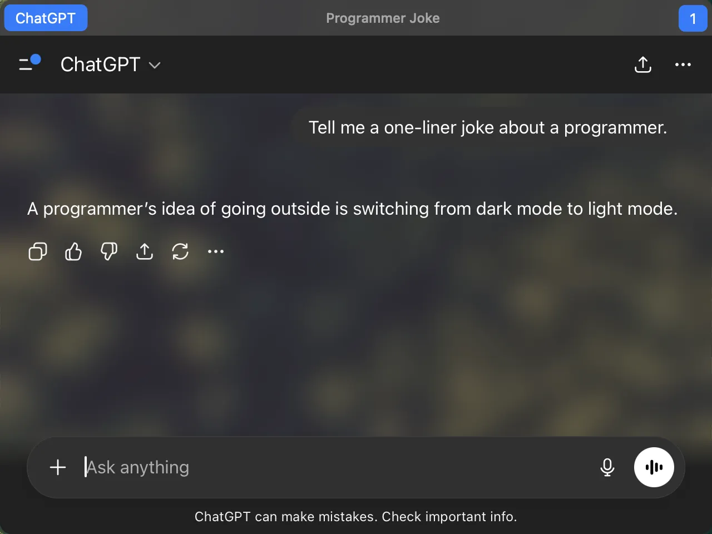
  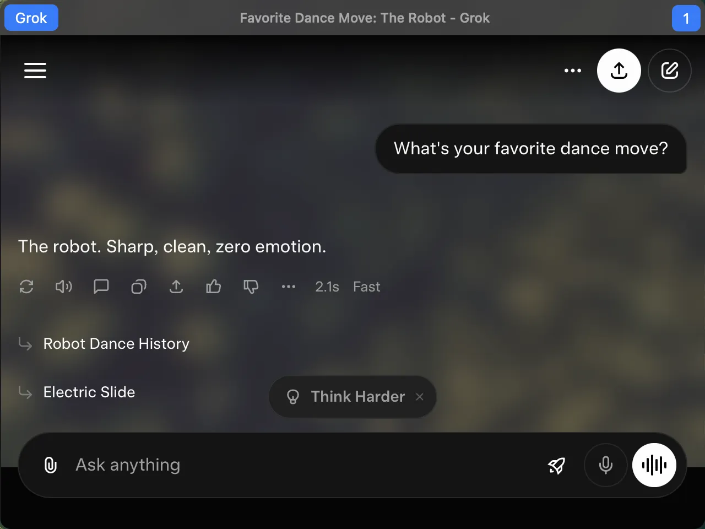
</p>
<p float="left">
  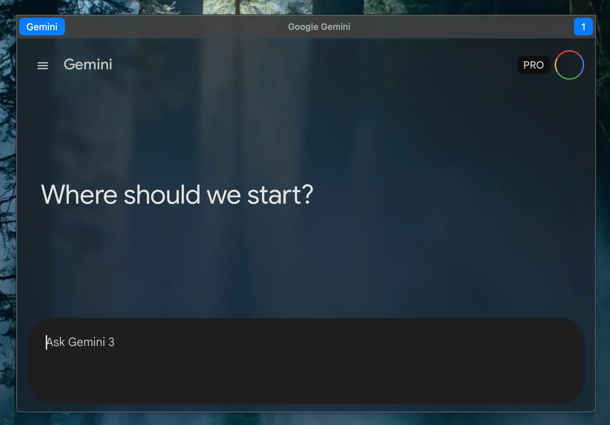
  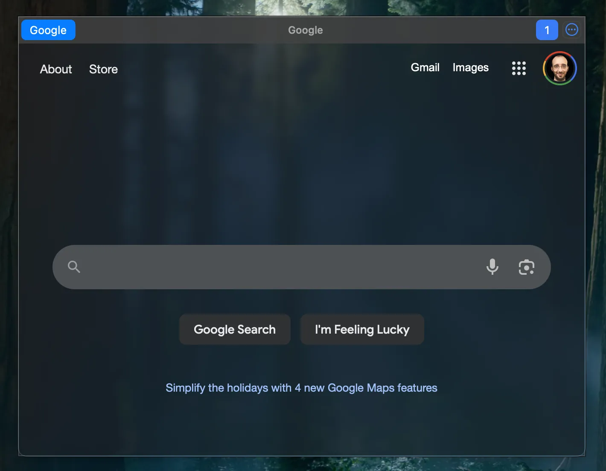
</p>
<p float="left">
  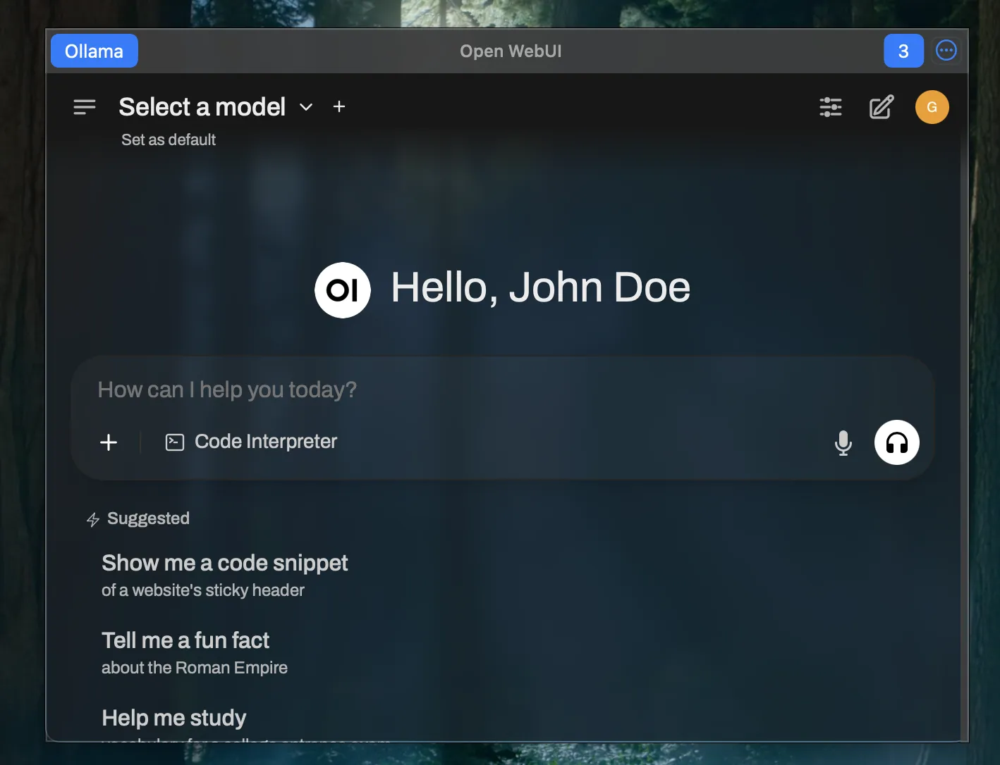
  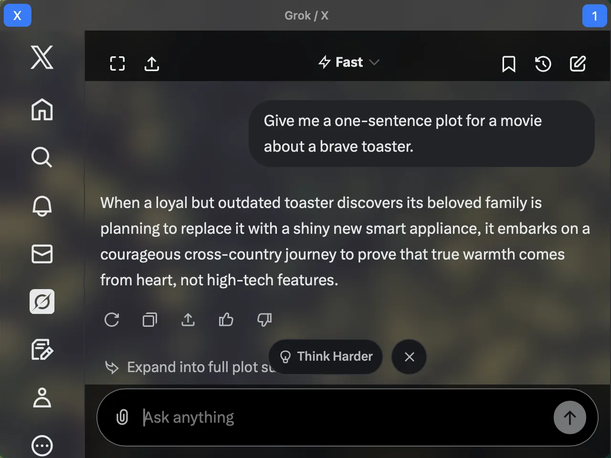
</p>

</details>

## Installation

**Requirements**: macOS 14.0+ (Sonoma), Apple silicon or Intel.

### Download a release

1. Download the latest `.app` from the [Releases](https://github.com/sassanh/quiper/releases/latest) page — direct download: [`Quiper.app.zip`](https://github.com/sassanh/quiper/releases/latest/download/Quiper.app.zip).
2. Move `Quiper.app` to `/Applications`.
3. Because this project isn't signed or notarized (Apple requires a paid Developer ID for that), Gatekeeper will block the first launch. Open **Settings → Privacy & Security** and click **Open Anyway** next to Quiper.
4. Relaunch `Quiper.app`, click **Open** on the follow-up dialog, and macOS will remember that exception for this bundle path.
5. Approve the notification prompt if you plan to use browser banners.

> If you rebuild, rename, or move `Quiper.app`, Gatekeeper treats it as a new binary, so repeat steps 3–4 after each update.

<details>
<summary><strong>Update Settings</strong></summary>

Configuring automatic checks and downloads:

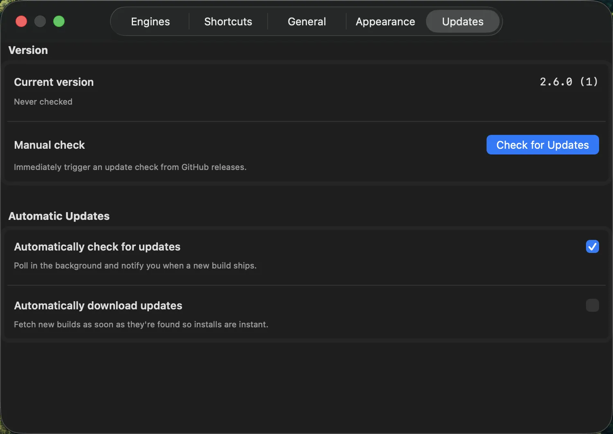
</details>

### Build from source

```bash
git clone https://github.com/sassanh/quiper.git
cd quiper
open Quiper.xcodeproj # Opens in Xcode
# Press Cmd+R to build and run
```

Create a distributable bundle:

```bash
./build-app.sh # Builds with xcodebuild, creates Quiper.app
open Quiper.app
```

## Daily Workflow

### Global hotkey

- Default `⌥ Space` toggles the overlay above every desktop.
- Capture a new combo via Status menu → **Set New Hotkey**. The selection is saved into `~/Library/Application Support/Quiper/settings.json` under the `hotkey` key and re-registered immediately.

### Inside the overlay

| Action | Shortcut |
| --- | --- |
| Switch session 1–9 | `⌘ 1` … `⌘ 9` |
| Session 10 | `⌘ 0` |
| Switch service 1–9 | `⌘ ⌃ 1` … `⌘ ⌃ 9` (or `⌘ ⌥` + digit) |
| Open Settings | `⌘ ,` |
| Toggle Web Inspector | `⌘ ⌥ I` |
| Hide overlay | `⌘ H` |
| Find in page | `⌘ F` |
| Zoom in/out | `⌘ +` / `⌘ -` |

Dismissing the window via shortcut or menu simply hides it; Quiper reactivates the previously focused app automatically.

<details>
<summary><strong>Shortcut Configuration</strong></summary>

Customize global and in-app shortcuts:

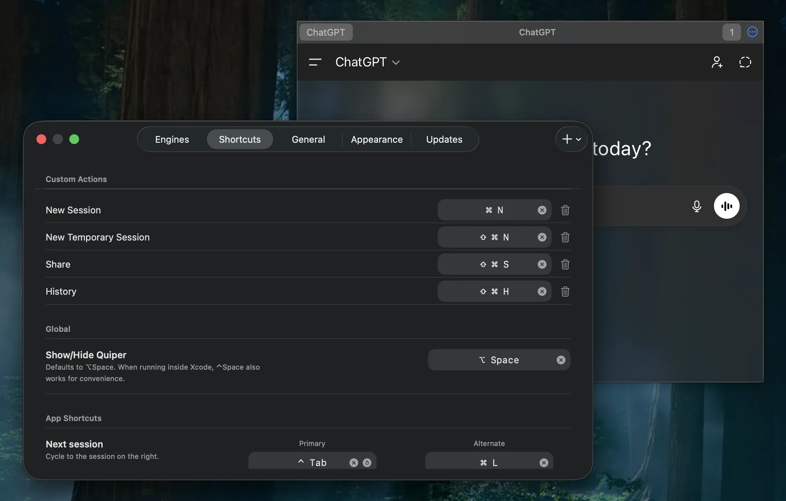
</details>

### Status-bar menu

- Show / Hide Quiper
- Settings window
- Show / Hide Inspector (reflects the active state)
- Clear Web Cache (purges `WKWebsiteDataStore.default()`)
- Set New Hotkey
- Install at Login / Uninstall from Login
- Quit

## Appearance

Quiper supports per-theme window customization:

- **Color Scheme**: Force Light or Dark mode, or follow System preference.
- **Window Background**: Choose blur effect (with material options) or solid color.
- **Per-Theme Settings**: When using System mode, configure light and dark themes separately.

<p float="left">
  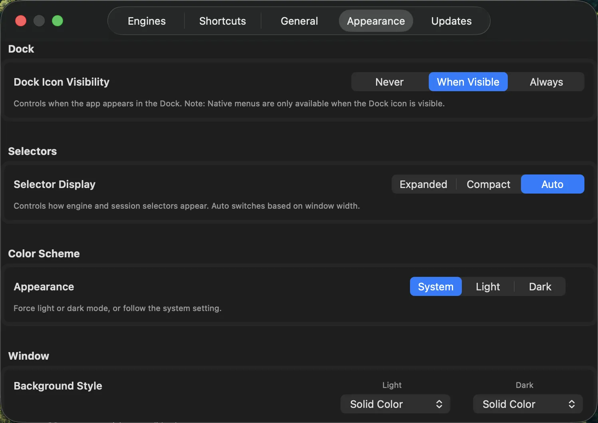
  
</p>

## Customization

- **Services** – Drag services directly in the header segmented control or open Settings → Engines to add/delete/reorder entries. Each service includes a CSS selector used to focus the correct input field when the session becomes visible.
- **Custom CSS** – Inject custom CSS per-engine for transparent backgrounds or style overrides.
- **Custom Actions** – Define JavaScript snippets triggered by global or app-specific shortcuts to automate tasks (e.g., clicking 'New Chat' or scraping content).
- **Manual edits** – All preferences live at `~/Library/Application Support/Quiper/settings.json`. Edit while Quiper is closed.

<details>
<summary><strong>Expanded Selectors</strong></summary>

Show full service details and conversation context:

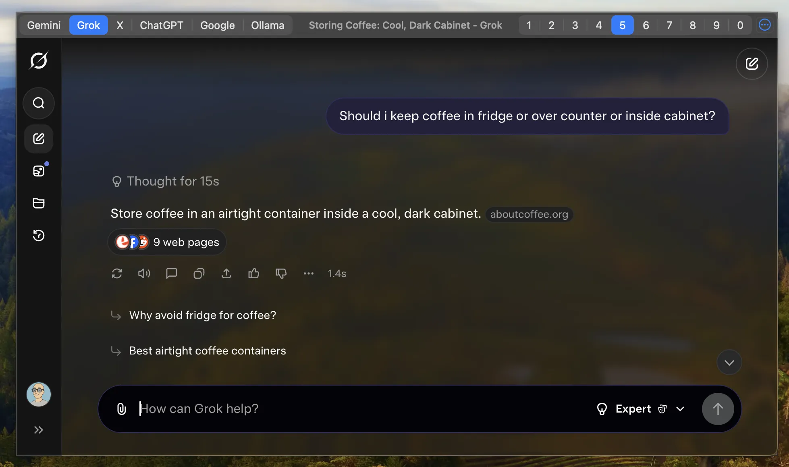
</details>

<details>
<summary><strong>Service Configuration</strong></summary>

Manage engines and custom actions:


Define hotkeys for specific services:

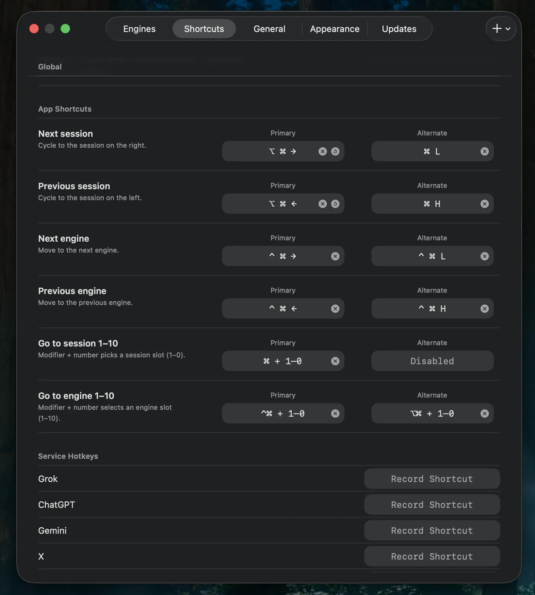
</details>

## Technical Details

### Sessions and Storage

- Each service entry in `settings.json` spawns ten `WKWebView`s during startup. Quiper hides all but the active view, so switching is instantaneous.
- WebKit data (cookies, local storage, cache) is shared. Logging out of a service in one session signs out the others.
- The default services (ChatGPT, Gemini, Grok) live in `Settings.shared.defaultEngines`.

### Notifications

- `WebNotificationBridge` installs a user script that patches `Notification`, `Notification.requestPermission`, and `navigator.permissions.query` to match Safari's behavior.
- When a site issues `new Notification(...)`, Quiper builds a `UNNotificationRequest` with the service URL, display name, and session index stored in `userInfo`.
- `NotificationDispatcher` implements `UNUserNotificationCenterDelegate`; clicking a banner brings Quiper to the front, selects the recorded service, and activates the session before focusing the input field.

## Reset & Data Paths

| Item | Path | Notes |
| --- | --- | --- |
| Settings | `~/Library/Application Support/Quiper/settings.json` | JSON object; edit while Quiper is closed. |
| LaunchAgent | `~/Library/LaunchAgents/com.<username>.quiper.plist` | Created/removed via Install at Login. |
| Downloads | `~/Downloads/` | Files initiated inside Quiper are saved here. |

Hit **Clear Web Cache** in the status menu to wipe cookies/cache without touching the JSON. For a full reset, quit Quiper and delete the settings file.

<details>
<summary><strong>General & Danger Zone</strong></summary>

Reset options and general configuration:

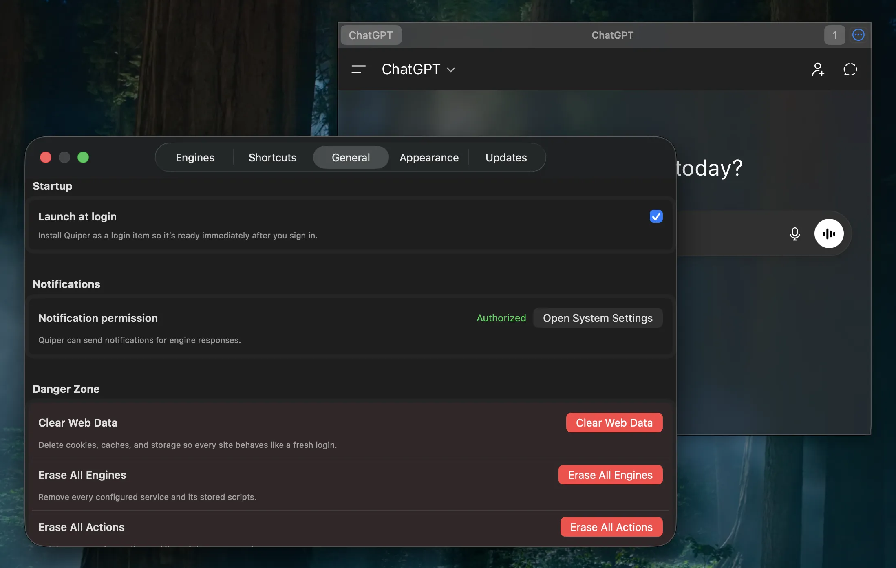
</details>

## Troubleshooting

- **Global hotkey fails** – Capture a new one so Quiper overwrites the `hotkey` entry in `settings.json`.
- **Notifications never appear** – Use the status menu to open macOS notification settings and ensure alerts are allowed.
- **Web view stuck or stale** – Use **Clear Web Cache** or reload the service.
- **Build errors** – Ensure Xcode 16+ CLT are installed (`xcode-select --install`).

## Contributing

1. Fork the repository and branch from `main` (`feat/<topic>`).
2. Run `swift build` before opening a pull request.
3. Include macOS version, Quiper build hash, repro steps, and screenshots for UI changes.

## License

Quiper is released under the [MIT License](LICENSE).
