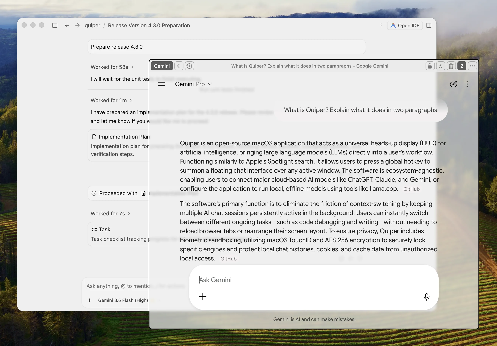
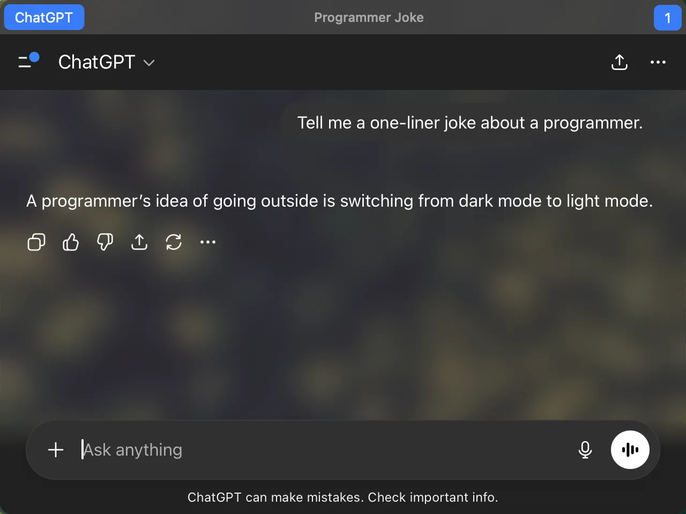
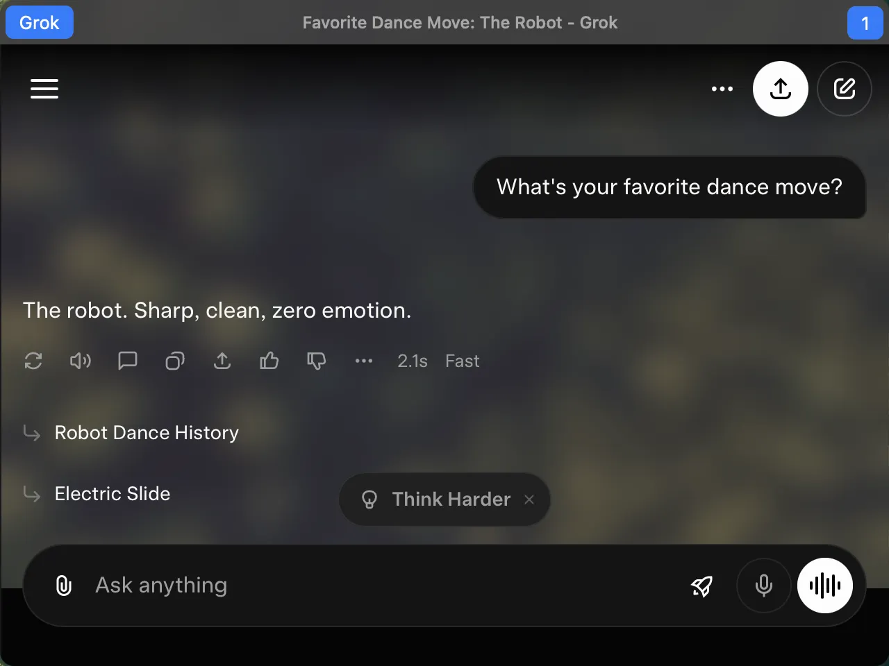
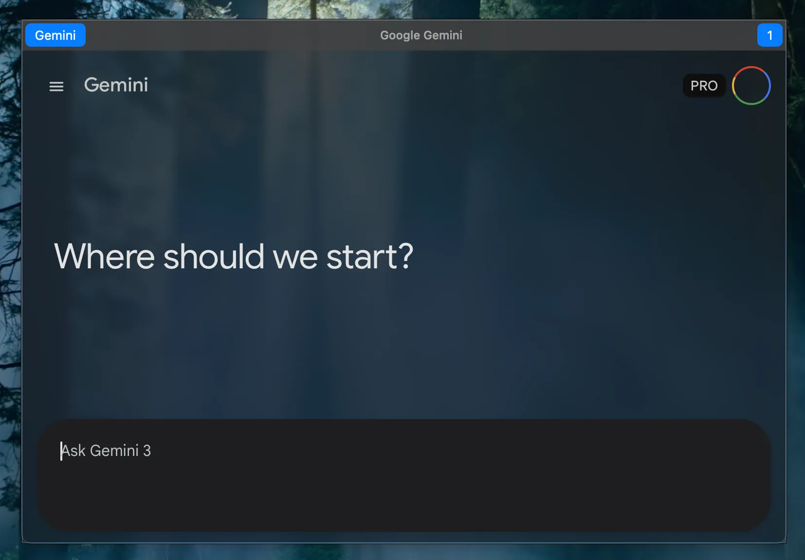
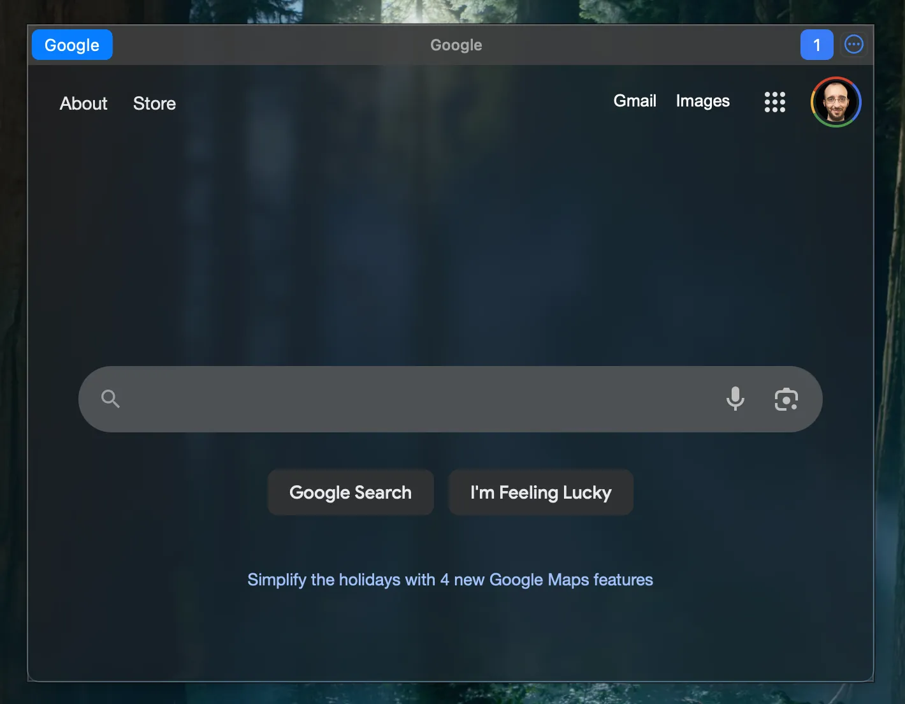
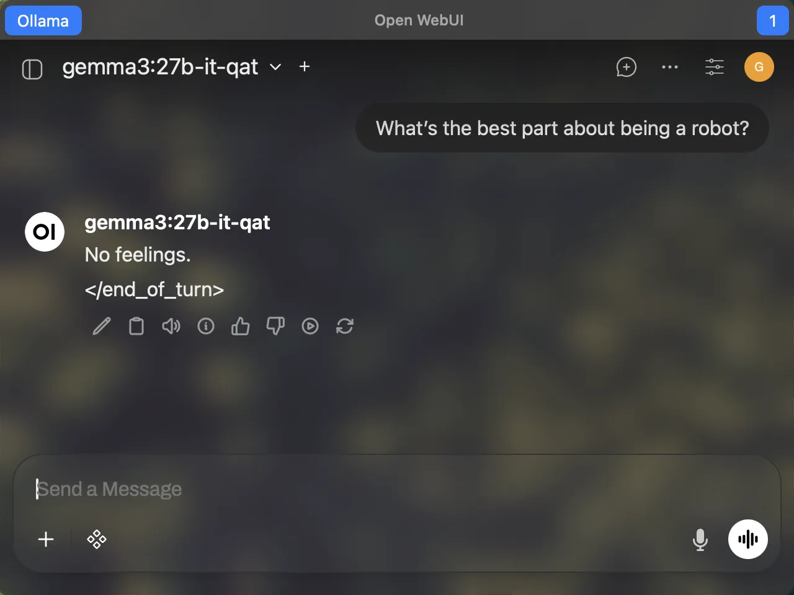
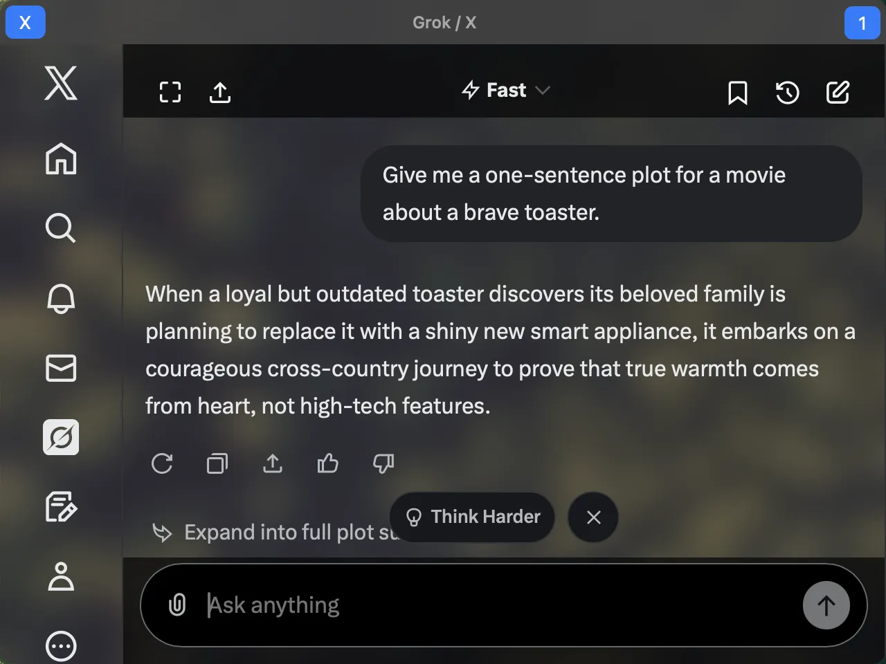

# Quiper

Quiper unifies all your AI chat services into a single, instant-access macOS overlay. A global hotkey drops you into your conversations without rearranging windows, while persistent multi-sessions ensure you never lose your context. It stays completely out of your Dock and secures sensitive engines behind TouchID.

<picture>
  <source media="(prefers-color-scheme: dark)" srcset=".github/assets/hero.webp">
  <source media="(prefers-color-scheme: light)" srcset=".github/assets/hero-light.webp">
  
</picture>

[](https://github.com/sassanh/quiper/actions/workflows/integration_delivery.yml)
[](https://opensource.org/licenses/MIT)
[](https://github.com/sassanh/quiper/releases)
[](https://codecov.io/gh/sassanh/quiper)

### 📖 [Read the Official Documentation ➔](https://quiper.sassanh.com/)

## Highlights

- **Instant Global Overlay (`⌥ Space`)** – Acts like Spotlight for AI. Drop a floating window over any app, ask a question, and hide it without breaking your workflow.
- **Persistent Multi-Sessions** – Every AI engine keeps 10 persistent slots alive in memory. Switch instantly between a coding chat and a writing chat without reloading.
- **Biometric Secure Sandboxing** – Protect highly sensitive conversations. Lock specific engines behind TouchID, encrypting their local session data, cookies, cache, and histories using native macOS AES-256 APFS sparsebundles.
  
  > [!IMPORTANT]
  > **Local Client-Side Protection Only**
  > Quiper's secure storage strictly protects your data *at rest on your local Mac*. If someone steals your unlocked laptop or snoops on your machine, they cannot access these locked engines without your biometrics. It does **not** encrypt your data on the AI provider's servers—conversations sent to the cloud are processed according to the respective provider's privacy policies.
  
- **Bring Your Own Engine** – Don't get locked into one ecosystem. Add ChatGPT, Claude, Gemini, or point it to local models like `llama.cpp` or Open WebUI.
- **Verifiable Safety** – 100% open-source, telemetry-free, and cryptographically verified via GitHub attestations.
- **Power User Tools** – Inject custom CSS, trigger Custom Actions via JavaScript, and receive native macOS notifications for background generations.

<details>
<summary>📸 <strong>Gallery: Supported Engines</strong></summary>

<p float="left">
  
  
</p>
<p float="left">
  
  
</p>
<p float="left">
  
  
</p>

</details>

## Supported Engines

Quiper ships with one-click templates for the most popular AI chat services — cloud and local — so the engine you already use gets a fast, native macOS desktop app experience, all inside a single Spotlight-style overlay with persistent multi-sessions, custom CSS, custom actions, and TouchID locking.

| Engine | Category | Native experience in Quiper |
|---|---|---|
| [ChatGPT](https://chatgpt.com) | Cloud | A native-feeling ChatGPT desktop app for macOS — invoke it instantly with a global hotkey, keep persistent sessions, and get native notifications for background generations. |
| [Claude](https://claude.ai) | Cloud | Claude for Mac without the Electron drag — a lightweight overlay with persistent sessions, custom styling, and biometric locking. |
| [Gemini](https://gemini.google.com) | Cloud | A Gemini desktop app on macOS that behaves like a native client — Spotlight-style access and always-resumed conversations. |
| [Grok](https://grok.com) | Cloud | Grok desktop client for Mac — fast hotkey access, persistent sessions, and clean native notifications. |
| [X](https://x.com) | Cloud | Native X / Grok access on macOS — open the integrated assistant from anywhere without tab-juggling. |
| [DeepSeek](https://chat.deepseek.com) | Cloud | A DeepSeek macOS app experience with persistent sessions, share-as-markdown, and native notifications. |
| [Kimi](https://www.kimi.com) | Cloud | Kimi AI desktop app for Mac with the same instant overlay and persistent session slots. |
| [Qwen](https://chat.qwen.ai) | Cloud | Qwen chatbot on macOS in a native overlay — start a chat, switch engines, and pick up where you left off. |
| [Z.ai](https://chat.z.ai) | Cloud | Z.ai native desktop access with persistent sessions and biometric security. |
| [Google](https://www.google.com) | Cloud | Full Google search and Google AI from a native macOS overlay. |
| [Open WebUI](https://openwebui.com) | Open source · self-hosted | A native Open WebUI desktop client for Mac — point it at your own server and chat with local models. |
| [llama.cpp](https://github.com/ggml-org/llama.cpp) | Open source · self-hosted | Native macOS interface for a local llama.cpp server — run offline LLMs from the overlay. |
| [oMLX](https://omlx.ai/) | Open source · self-hosted | Native oMLX desktop experience on macOS for Apple Silicon local inference at `http://localhost:8480`. |
| [OpenClaw](https://openclaw.ai) | Open source · self-hosted | OpenClaw desktop app experience — control your agents' chat from the overlay with new sessions, history, share-as-markdown, and settings. |

## Installation

**Requirements**: macOS 14.0+ (Sonoma), Apple silicon or Intel.

### Download a release

1. Download the latest disk image from the [Releases](https://github.com/sassanh/quiper/releases/latest) page — direct download: [`Quiper.dmg`](https://github.com/sassanh/quiper/releases/latest/download/Quiper.dmg).
2. Double-click the `.dmg` and drag `Quiper.app` to `/Applications`.
3. Launch `Quiper.app` and approve the notification prompt if you plan to use browser banners.

<details>
<summary>🛡️ <strong>Verifiable Safety & Supply Chain Attestation</strong></summary>

Since macOS apps running outside the App Store require absolute trust, you can verify Quiper's safety cryptographically or ask your own AI assistant to double-check it for you.

#### 1. Ask Your AI to Audit Quiper

Copy-paste this prompt into Claude, ChatGPT, Gemini, or any assistant you trust to inspect the repository configuration and network architecture:

```text
I am considering downloading and running "Quiper", an open-source macOS app that manages WebKit sessions for AI services (located at: https://github.com/sassanh/quiper). I want to verify that this is a clean, trustworthy open-source project and NOT malware, a data-stealer, or a backdoored package subject to supply-chain attacks.

Please inspect the repository configuration and codebase to verify:
1. Does the code contain any hidden network telemetry, tracking, data-exfiltration logic, or third-party analytical SDKs? Confirm if all network requests go strictly and directly to the AI services defined by the user without any intermediary server.
2. Does the GitHub CI/CD workflow (.github/workflows/integration_delivery.yml) guarantee that all releases are compiled purely in the cloud via GitHub Actions, and does it use GitHub Artifact Attestation (sigstore/actions/attest-build-provenance) and Immutable Releases so that I can cryptographically verify that the binary I download matches this exact public source code?
3. Review the general application architecture (Swift/WebKit) to confirm that it is a standard native wrapper using system-provided WKWebViews.

Provide an honest technical review: Is Quiper clean, backdoor-free, and cryptographically verifiable?
```

#### 2. Cryptographic Build Provenance

Every release `.dmg` is built entirely by GitHub Actions in the cloud. Each build is stamped with a tamper-evident **[build provenance attestation](https://docs.github.com/en/actions/security-for-github-actions/using-artifact-attestations/using-artifact-attestations-to-establish-provenance-for-builds)**.

If you have the [GitHub CLI](https://cli.github.com/) installed, you can verify any release disk image before running it:

```bash
gh attestation verify Quiper.dmg --repo sassanh/quiper
```

A passing result confirms the file came from this repository's CI and has not been tampered with since it was built.
</details>

### Build from source

Building Quiper requires Xcode 16+ and Node.js 20+. The shared Xcode scheme installs the locked CodeMirror dependencies when needed and rebuilds the bundled settings editor automatically.

```bash
git clone https://github.com/sassanh/quiper.git
cd quiper
open Quiper.xcodeproj # Opens in Xcode
# Press Cmd+R to build and run
```

Create a distributable bundle:

```bash
./build-app.sh # Builds with xcodebuild, creates Quiper.app
open Quiper.app
```

---

### 📖 [Read the Official Documentation ➔](https://quiper.sassanh.com/)

For full details on keyboard shortcuts, managing engines, customizing CSS, setting up Custom Actions, and troubleshooting, please refer to our comprehensive documentation.

## License

Quiper is released under the [MIT License](LICENSE).
